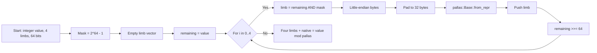

# Spec: Zk-Airdrop Claiming
>
> **GOAL: Allow eligible headstash members to use zk-proofs to claim partial amounts of their rewards over time, onto a clearnet account.**

## Context

The Headstash contract is the claim desk for Product A. A person who already has an eligible secp256k1 key (for the community drop, the Ethereum key that signed from the allocated address) proves they know that key, proves one pre-issued note sits under the published distribution root, and the contract mints the note's public value to a public recipient. This is a clearnet claim. It is not a private-dex spend and it is not a shielded transfer.

These external addresses are pre-mapped as "eligible" for specific token allocations. The notes are cut ahead of time, off chain, into fixed denomination pieces so one allocation can be claimed in parts, to more than one recipient, over time.

Naively, claiming would make the user publish an ECDSA signature of a message `m` that contains the recipient `recp`. That signature is a public binding between the eligible key and the new account that receives the funds.

```math
\sigma = \text{Sign}_{\text{elig}_{\text{sk}}}\big( H(m) \big), \quad \text{where } \text{recp} \in m
```

<center>

> **That signature is public, so the chain learns which eligible key paid which recipient.**

#### *The circuit replaces the signature. It still proves key ownership and eligibility, and the mint itself stays public: amount, denomination, and recipient are instance columns on purpose, because the contract has to mint the right coins to the right account.*

___

</center>


### Privacy On Transparent Ledgers
*The claim is public. What we still refuse to publish is the eligible secret, and we try not to publish a unique fingerprint of which eligible key was used. Three obstacles:*

### Q: How Does Someone Prove They Own An Eligible Wallet Without Revealing The Actual Eligible Wallet?
**A: personal_sign.** The wallet signs `headstash-claim-v1:` plus the hex of `keccak256` of the 168-byte claim prefix. The circuit checks that signature under the leaf key: `R = (e·s⁻¹)·G + (r·s⁻¹)·Q` and `R.x ≡ r (mod n)`. `e` is public (two 128-bit halves). `r`, `s`, and `Q` are witnesses. `esk` is not a witness. The multiplications are the same GLV split as before. The chain sees the proof and `e`, not the key and not `(r, s)`.

### Q: How can someone prevent leaking where their claimed funds end up, if the total amount & distributions allocated are public?

The distribution tree is public, and each claim publishes `nd`, `v`, and `recp`. A leaf that is the only one with that `(nd, v)` can be matched back to its `epk` by anyone who has the tree. Fixed denominations exist so many notes share the same public value and the match is not unique.

**A: Fixed Denomination Notes.** Notes are the private packets inside a public tree. Each note is one piece of an allocation (`v` at index `fdi` for denomination `nd`). The pieces are built non-interactively before the claim. A member can spend them one at a time, to different recipients. `fdi` stays a witness. `v` and `nd` do not.

### Q: How are users prevented from claiming more funds then they are allocated?

**A: nullifiers.** One note, one nullifier. The contract stores spent nullifiers and will not mint twice for the same one. The nullifier is a public instance. It is derived from the note so that changing the note changes the nullifier, and so that someone who does not know the note cannot grind a second nullifier for the same leaf.

> **Notes About Design**
> The shape borrows from Zcash Orchard (a spent note, a nullifier, a commitment, a Merkle opening) and then drops the parts Product A does not use. Two discrepancies matter:
>
> **1. The action pays a transparent account**
> A claim reveals how much, of which denomination, and to whom. It also reveals the nullifier and the note commitment digest. That is the mint. It is not a shielded output.
>
> **2. Viewing keys are not in this iteration**
> We do not use diversifiers, incoming viewing keys, or spending keys to authorize the claim. The eligible secp256k1 key is the spending authority. A nullifier key `nk` is still derived, but only as Poseidon(`DST`, `esk` as a Pallas base, `rho`), so the Orchard nullifier equation has something to bind to.
>
## Requirements

- **Proof of ownership:** personal_sign under the leaf key, verified in the circuit. No `esk·G` pairing. No "divide by G".
- **Proof of inclusion:** a depth-32 Poseidon-v1 Merkle opening of a public distribution leaf under the published root (`anchor`). The leaf is not a Sinsemilla hash.
- **Nullifier and note commitment:** Poseidon-v1 commitment digest `cmx`, lifted to a Pallas point only so the nullifier can use the Orchard ECC equation. The contract's spent-nullifier set is what stops a second mint.
- **On-chain verification:** one Halo2 IPA proof, `K = 18`, six instance columns, 4704 bytes. The contract checks it with `proof_instance_verify` when `claim_mock_verify` is false. Mock verify is a lab switch, not the product gate.
- **Clearnet mint:** the recipient, value, and denomination in the claim message are the ones the proof opened. The contract mints those coins. It does not shield them.
- **Metamask Snap:** the snap can check that the ETH key at `m/44'/60'/…` matches `elig_pk` without exporting `esk`. Halo2 proving still runs on the host. The snap worker does not prove this circuit today.

Not in this circuit: a TEE, a randomness oracle, or a second shielded pool. Those are other products.

___

## Hashes, Keys, Fields, Curves

### Keys

Three key-shaped values show up in a claim. Only the first one is a secp256k1 keypair.

1. **Eligible keys:** the secp256k1 key that owns a public allocation. For the community drop this is the Ethereum key that signed from the allocated address. `esk` stays in the witness. `epk` is also a witness, and it is the point the distribution leaf commits to.
2. **Recipient:** not a key inside the circuit. It is 32 canonical bytes (`RecpAddr`). Community notes pack this as 12 zero bytes followed by the 20-byte Ethereum address. The circuit hashes those bytes. The claim message carries them raw, and that is the account that gets minted to.
3. **Pallas scalars derived from `esk`:** `esk` reduced into `pallas::Base`, then `nk = Poseidon(DST_HKDF, esk_pallas, rho)`. These are not a second wallet. They feed the note commitment and the nullifier.

> Orchard viewing and authorization keys are not how a Product A claim is authorized. `nk` exists so the nullifier equation has a key, not so a viewing key can decrypt the note.

| # | Key type | Curve | What it is | Public / private | Notes |
|---|----------|-------|------------|------------------|-------|
| 1 | **Eligible key** | secp256k1 | `e`, `(r, s)`, `epk = (x, y)` | `e` is a **public** challenge. `(r, s)` and `epk` are witnesses. `esk` is not in the circuit. | `Secp256k1Chip::prove_ecdsa_verify`. |
| 2 | **Recipient** | none | 32-byte `RecpAddr` | **Public** as raw bytes on the claim, and as `recp_to_fp` in the instance. | `Poseidon` of two little-endian `u128` halves. Not a bech32 string inside the circuit. |
| 3 | **`nk`** | Pallas base | Poseidon(`DST_HKDF`, `esk_pallas`, `rho`) | **Witness** | `NullifierDerivingKey::derive_from`. Then `PRF_nf(nk, rho) = Poseidon(nk, rho)`. |

### Curves

The circuit is a Pallas circuit. secp256k1 is a foreign field: 4 limbs of 64 bits, checked with the shared 10-bit lookup. Proving is IPA over Vesta (`K = 18`).

| Role | Field | Curve | Value |
|------|-------|-------|-------|
| Native base | `Fp` | Pallas | `p = 0x40000000000000000000000000000000224698fc094cf91b992d30ed00000001` |
| Native scalar / IPA | `Fq` | Vesta (IPA), Pallas scalar where a scalar is required | `q = 0x40000000000000000000000000000000224698fc0994a8dd8c46eb2100000001` |
| Foreign base (`epk` x, y) | secp256k1 `Fp` | secp256k1 | `p = 0xfffffffffffffffffffffffffffffffffffffffffffffffffffffffefffffc2f` |
| Foreign scalar (`esk`) | secp256k1 `Fq` | secp256k1 | `n = 0xfffffffffffffffffffffffffffffffebaaedce6af48a03bbfd25e8cd0364141` |

GLV constants on that scalar field are the Bitcoin Core ones: `λ` for the split, `β` for `ψ`. They are pinned in the chip, not chosen by the prover.

## Hashes

Poseidon-v1 (`P128Pow5T3`, width 3, rate 2, capacity 1, `ConstantLength`) is the hash the claim actually uses. Sinsemilla personalizations are still in the crate from the Orchard port. They are not the distribution tree and they are not the note commitment.

Blake3 is only the out-of-circuit packing of a denomination string into a field element.

### Note commitment

```text
cmx = Poseidon_CL<9>(
  "terp-hs-note-commit-v1",
  nd, v, fdi, recp, esk_pallas, rho, psi, rcm_base
)
cm_point = [cmx] · NoteCommitR
```

`cmx` is the public extracted commitment. It is the Poseidon digest, not an x-coordinate extracted from a Sinsemilla point. `cm_point` exists so the nullifier can add a curve point. `rcm` is inside the Poseidon message only. There is no second `[rcm]·R`.

`rcm` is a Pallas scalar. `rcm_base` is that scalar's little-endian bytes read as a base field element when they fit, otherwise `from_uniform_bytes` on the 64-byte widening. `esk_pallas` is the secp256k1 secret as an integer, reduced into `pallas::Base` (`esk_to_base`). `recp` in this hash is already `recp_to_fp`.

### Nullifier

```text
rseed_lo, rseed_hi = the note's 32-byte string, split into two 16-byte halves
rho     = rseed_lo
psi     = rseed_hi
rcm     = rseed_lo + rseed_hi
nk      = Poseidon_CL<3>(DST_HKDF, rseed_lo, rseed_hi)
prf_nf  = Poseidon(nk, rho)
nf      = Extract_P( [prf_nf + psi] · NullifierK + cm_point )
```

The 32-byte string is sampled once when the note is created. It is not derived from `esk` or from the public leaf. Each half is a `u128`, so all 256 bits are kept.

`rho` and `psi` are those halves, copied, not hashed again. `rcm` is one addition. `nk` is a Poseidon of the string alone. The eligible key is not in it: ownership is the personal-sign check. A free witness `nk` does not verify.

`DST_HKDF` is the 32-byte constant `b"Hkdf_headstash_710_terp.network\0"`, read as a Pallas base element and pinned with `constrain_constant`. It is not a prover input.

`NullifierK` is the Orchard hash-to-curve generator `hash_to_curve("z.cash:Orchard")(b"K")`. `Extract_P` is the Pallas x-coordinate extractor. The result is one base field element and it is instance column `nf`.

The chain stores that `nf` and rejects a second spend of the same value. The circuit is what makes a second `nf` for the same leaf impossible: the string that feeds `nk` / `rho` / `psi` is the string committed in the leaf, below. Publishing `nf` is not a lookup of `(epk, nd, v, fdi)`. An observer who has the tree and the nullifier still does not have the string, so they cannot recompute `nf` from a leaf.

### Distribution leaf and root

The tree is public and depth 32. A missing sibling is `pallas::Base::ZERO`. Layer 0 hashes two leaves. The layer counter goes up toward the root. That is not Orchard's `MERKLE_DEPTH - layer - 1` index.

```text
rseed_com = Poseidon_CL<3>("terp-hs-rseed-v1", rseed_lo, rseed_hi)
leaf = Poseidon_CL<7>(
  "terp-hs-distro-leaf-v1",
  epk_x, epk_y, nd, v, fdi, rseed_com
)
node = Poseidon_CL<4>(
  "terp-hs-distro-crh-v1",
  layer, left, right
)
```

`epk_x` and `epk_y` are the affine secp256k1 coordinates as integers reduced into `pallas::Base` (the native value of the foreign-field limbs). The full `y` is used. It is not a sign bit.

The root is instance column `anchor`. On the wire it is the canonical little-endian 32 bytes of that base field element. Contracts must treat the domain as `poseidon-v1` and must not verify these roots as Sinsemilla.

### What is public, and what is a witness

One instance column, six used entries. The Halo2 array is nine scalars wide. Entries 6, 7, and 8 stay zero.

| Column | Name | Role |
|--------|------|------|
| 0 | `anchor` | Poseidon-v1 distribution root |
| 1 | `nd` | Denomination field element |
| 2 | `v` | Note value (`u64` as a base field element) |
| 3 | `recp` | `recp_to_fp` of the 32-byte recipient |
| 4 | `nf` | Nullifier |
| 5 | `cmx` | Poseidon note-commitment digest |

`Instance::to_bytes` is 168 bytes and stores the recipient as raw 32 bytes, not as the Poseidon digest. `to_halo2_instance` is what the proof is checked against, and that column is `recp.to_fp()`. The contract checks the claim's recipient bytes against the raw field in the instance blob. The proof binds the hash.

Witnesses the chain does not get as instances: `esk`, `epk_x`, `epk_y`, `fdi`, the 32-byte note string, `rho`, `psi`, `rcm`, `nk`, the 32 Merkle siblings, and the leaf position. The leaf publishes `rseed_com`, not the string.

### Poseidon uses

| Name | Message | Where |
|------|---------|-------|
| `recp_to_fp` | two `u128` halves of the 32-byte address, little-endian | instance column `recp`, and the note commitment |
| `terp-hs-rseed-v1` | `rseed_lo`, `rseed_hi` | `rseed_com` inside the public leaf |
| nullifier key | `DST_HKDF`, `rseed_lo`, `rseed_hi` | `nk` |
| `prf_nf` | `nk`, `rho` | nullifier scalar |
| note commit | tag + `nd, v, fdi, recp, esk, rho, psi, rcm_base` | `cmx` |
| distro leaf | tag + `epk_x, epk_y, nd, v, fdi, rseed_com` | inclusion |
| distro CRH | tag + `layer, left, right` | inclusion, 32 layers |

### Blake3

`NoteDenom::new_for_proof` hashes the denomination string with Blake3 and clears the top 3 bits of the little-endian field encoding (`bytes[31] &= 0x1F`) so the digest is a canonical Pallas base element. The denomination is public. Collision resistance of a 253-bit digest is not the thing we are spending here. Contracts keep the map from the original denom string to this field element, and the mint denom has to be that same trimmed value. Masking byte 0 instead of byte 31 will not verify.

| Use | What it is |
|-----|------------|
| `NoteDenom::hash` | Blake3 of the denom string |
| `NoteDenom::new_for_proof` | that digest with the top 3 bits cleared |

### Inputs, in one table

| Component | Meaning | Public or witness |
|-----------|---------|-------------------|
| `anchor` | distribution root | **Public** |
| `nd` | trimmed Blake3 denom | **Public** |
| `v` | note value, `u64` | **Public** |
| `recp` | 32-byte recipient, hashed into the instance | **Public** |
| `nf` | nullifier | **Public** |
| `cmx` | Poseidon note digest | **Public** |
| `esk`, `epk` | eligible secp256k1 keypair | **Witness** |
| `fdi` | which fixed-denomination piece | **Witness** (it is inside the public leaf preimage) |
| `rseed` | 32-byte string, sampled once per note | **Witness** |
| `rho`, `psi`, `rcm` | the two halves, and their sum | **Witness** |
| `nk` | Poseidon of `DST_HKDF` and that string | **Witness** |
| `e`, `r`, `s` | personal_sign over the claim prefix | **Witness**. `e` is also public |
| `path`, `pos` | depth-32 opening | **Witness** |

`rho`, `psi`, and `rcm` are not the Orchard `PrfExpand` expanders on this path. A second string is a different `rseed_com`, so it does not open the published leaf, and it is a different nullifier. The old `hdkf_pallas(esk, rho)` derivation is not what the claim checks.

## Distribution tree

**This tree is built off chain and then published.** Its job is eligibility: a leaf binds one `epk` to one `(nd, v, fdi)` piece and to one hiding commitment of that note's random string. The prover shows that leaf opens to the public root, and shows the `epk` on the leaf is the point of the `esk` they know.

The tree does not hide the allocation from someone who has the note file. It stops a proof from minting a `(nd, v)` that was never in the root, it stops a proof from using an `epk` that was not on that leaf, and it stops a second random string from opening the same piece. The string itself is not in the leaf. `rseed_com` is.

```math
\begin{aligned}
\mathrm{rseed\_com}
&= H_{\texttt{terp-hs-rseed-v1}}(\mathrm{rseed\_lo} \,\|\, \mathrm{rseed\_hi}) \\[4pt]
\mathrm{leaf}
&= H_{\texttt{terp-hs-distro-leaf-v1}}(
    epk_x \,\|\, epk_y \,\|\, nd \,\|\, v \,\|\, fdi \,\|\, \mathrm{rseed\_com}
) \\[4pt]
\mathrm{anchor}
&= H_{\texttt{terp-hs-distro-crh-v1}}^{\,32}(\mathrm{leaf},\,\mathrm{path},\,\mathrm{pos})
\end{aligned}
```

<center>

| Symbol | Meaning |
|--------|---------|
| `epk_x`, `epk_y` | secp256k1 coordinates of the eligible key, as Pallas base elements |
| `nd` | trimmed Blake3 of the token name |
| `v` | amount of this piece |
| `fdi` | index of this piece inside the allocation. Witness in the proof. Part of the leaf preimage. |
| `rseed_com` | Poseidon of the note's hidden 32-byte string. Not the string. |
| `path` | 32 sibling digests |
| `pos` | leaf index, used to order each pair |

</center>

### Account file

A client can keep a yaml (or the notes file) of what an account still has. That file is not a circuit input. If it lists every `epk` and `fdi`, it is enough to undo the fixed-denomination mixing, so it should be treated as private to the holder even though the genesis tree itself is public.

```yaml
id: "0"
balance:
  - nd: "uterp"
    v: "1000000"
    fdi: "3"
spent:
  - nd: "uterp"
    v: "1000000"
    fdi: "1"
```

### Note commitments, and what they are not

`cmx` is public on every claim. It is not how we detect double spends. The nullifier is. `cmx` binds the private note fields (`fdi`, `esk`, `rho`, `psi`, `rcm`) to the public ones (`nd`, `v`, `recp`) so the mint cannot swap the recipient or the value out from under the proof.

> **q: do public `nd`, `v`, and `recp` ruin the hash?**
>
> a: they don't let you solve for `esk` or `rho`. They do let you notice a claim. That is the product. Hiding which eligible key it was depends on fixed denominations and on not publishing a lookup from `(nd, v, fdi)` to `epk`.

## Circuit: Chip Specs

`K = 18` (`2^18` rows). `K = 17` does not fit: the secp256k1 scalar multiplication plus a depth-32 Poseidon path use more than `2^17` rows. A native release prove of one claim, 10 threads, zakura Halo2, measured about 6.7s prove and 19s keygen after the GLV change. That number lives in `artifacts/snap-proof-bench.json` and will move. The proof is 4704 bytes either way, because the IPA proof size follows `K` and the column set, not the gate count inside the domain.

Advice is 10 columns. ECC wants that width. Poseidon runs in series on those columns rather than beside a second copy of the chip.

### Foreign field: 4 × 64-bit limbs

secp256k1 elements do not fit in one Pallas cell. Each one is four little-endian 64-bit limbs.

```text
value = limb[0] + limb[1]·2^64 + limb[2]·2^128 + limb[3]·2^192
```

The native cell is that integer reduced modulo the Pallas base field. Range checks use the shared 10-bit table: each 64-bit limb is seven 10-bit words (`64/10`, rounded up). The table is loaded with `[0, 2^10)`. It is the same table the Pallas ECC chip uses. It is not a Sinsemilla window table.

```rust
pub struct CrtInteger<F> {
    pub truncation: OverflowInteger<F>, // four limbs
    pub native: AssignedCell<F, F>,     // value mod pallas
    pub value: Value<BigInt>,           // witness integer, not a constraint by itself
}
```

`const LIMB_BITS: usize = 64;`
`const NUM_LIMBS: usize = 3` was the old 88-bit layout. The chip is `NUM_LIMBS = 4`.

Multiplication of two foreign elements is the `foreign_mul` gate: the prover supplies the product modulo the foreign modulus and a quotient, and the gate checks the limb polynomial modulo Pallas. Addition is a limb witness plus a range check. The GLV congruence does not trust that addition. It uses its own carry chain.

### Secp256k1 chip: `epk = esk · G`

`prove_key_pairing` is the ownership constraint.

1. Witness `esk` in the scalar field and `epk` in the base field. Range-check the limbs.
2. Split `esk` with the Bitcoin Core GLV constants. Pin each magnitude under 128 bits (`k1` and `k2` are in fact under the tighter published bounds).
3. Constrain `k1 + λ·k2 = esk + m·n` with a 64-bit carry chain. `m` is 0 or 1.
4. `ψ(G) = (β·G_x, G_y)`.
5. Two fixed 128-step double-and-add chains: `(2^128 + |k1|)·(±G) − 2^128·(±G)` and the same for `ψ(G)`. A zero half does not add a point to its inverse. The other half is the result.
6. Constrain the sum to the witnessed `epk`.

The old 256-step Montgomery ladder is still in the file and is not on this path.

The native Pallas ECC chip is separate. It is used for the note-commitment lift and for the nullifier point addition, not for `esk · G`.

### Poseidon chip

`Pow5Chip` / `P128Pow5T3`, configured once on the action circuit. Note commit runs first, then the 32-layer distribution path. A conditional-swap chip orders `(node, sibling)` from the leaf position. Tags are constants (`personalization_to_fp` of the UTF-8 strings above), not prover-chosen.

### What synthesize does, in order

1. Load the 10-bit range table.
2. `prove_key_pairing` → `(esk, epk)`.
3. Witness `nd`, `v`, `fdi`, `recp`, `psi`, `rho`, `nk`, and the two halves of the note string.
4. Bind `nd` and `recp` to instance columns 1 and 3.
5. Hash `rseed_com`. Copy `rho` and `psi` from the two halves, constrain `rcm` to their sum, and constrain `nk` to `Poseidon(DST_HKDF, esk, lo, hi)`. Poseidon note commit. Bind `v` and `cmx` to columns 2 and 5.
6. Derive the nullifier from the bound `nk`, `rho`, `psi`, and `cm_point`. Bind `nf` to column 4.
7. Poseidon leaf from `(epk_x, epk_y, nd, v, fdi, rseed_com)`, then 32 CRH steps. Bind the root to column 0.

## Metamask Snap

The snap is the place we do not want the user to paste `esk`. `generateProof` derives the ETH key at coin type 60, checks the compressed public key against `elig_pk`, and wipes the secret. It does not run this Halo2 circuit. Proving is the host bench (`snap_bench`) and the suite's `Proof::create`. The snap execution environment is one thread and has no `SharedArrayBuffer`, so it would not be the 6.7s number even if the prover fit in the guest.

More of the wallet surface is in [metamask-snap.md](./metamask-snap.md).

## Headstash Suite

The suite builds the note, the depth-32 Poseidon opening, the instance, and the proof. Product A orchestration (keys, `proof_instance_verify`, mock versus real verify) is in [PRODUCT-A-CW-ORCH-ICTRS-USAGE.md](./PRODUCT-A-CW-ORCH-ICTRS-USAGE.md). The older suite notes are in [suite.md](./suite.md).





## Research

- <https://seanbowe.com/blog/tachyon-scaling-zcash-oblivious-synchronization/>
- <https://0xparc.org/blog/zk-ecdsa-1>
- <https://github.com/stealthdrop/stealthdrop>
- <https://eips.ethereum.org/EIPS/eip-7524>
- <https://www.rfc-editor.org/rfc/rfc9380.html>
- <https://eprint.iacr.org/2017/1108.pdf>
- <https://github.com/stealthdrop/stealthdrop>
- <https://zips.z.cash/zip-0216>
- <https://medium.com/zokrates/efficient-ecc-in-zksnarks-using-zokrates-bd9ae37b8186>
- <https://datatracker.ietf.org/doc/html/rfc5869>
- <https://github.com/dusk-network/jubjub-schnorr>
- <https://christophe.petit.web.ulb.be/files/16PKC_primeECDLP.pdf>
- <https://forum.zcashcommunity.com/t/status-update-rfc-zec-nam-shielded-airdrop-protocol/49144>
- <https://ebuchman.github.io/pdf/snarks.pdf>
- <https://github.com/DelphinusLab/halo2ecc-s>
- <https://github.com/tahowallet/extension/pull/3638>
- <https://halo2.zksecurity.xyz/intro/>
- <https://github.com/Lightprotocol/light-poseidon>
- <https://www.youtube.com/watch?v=r9hJiDrtukI>
- <https://snaps.metamask.io/snap/npm/chainsafe/webzjs-zcash-snap/>
- <https://eprint.iacr.org/2025/2031.pdf>
- <https://github.com/axiom-crypto/halo2-lib/blob/community-edition/halo2-ecc/src/secp256k1/tests/ecdsa.rs>
- <https://zcash.github.io/halo2/user/wasm-port.html>
- <https://github.com/zcash/halo2/issues/443>
- <https://www.youtube.com/watch?v=pdHYe4GUT_o>
- <https://eprint.iacr.org/2017/1050.pdf>
- <https://github.com/zcash/zcash/issues/2465>
- <https://eprint.iacr.org/2008/096.pdf>
- <https://eprint.iacr.org/2025/695.pdf>
