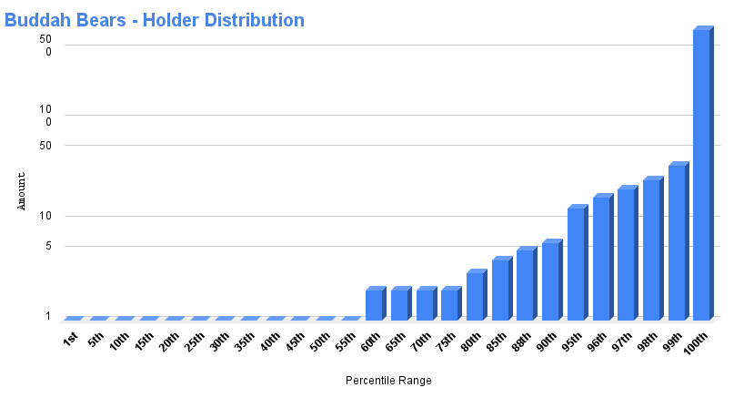

# Buddah Bears

- Etherscan link: <https://etherscan.io/token/0xde3f1f2083f826bc3f7f2f96e7e6b321294374b7#balances>

## Distribution

## Percentiles

| | Points | Min | Max | # In Percentile |
|--|--------|-----|-----|----------|
|59th| 1 | 1 | 1 | 1461 |
|90th| 2 | 2 | 6 | 769 |
|100th| 3 | 7 | 790 | 223 |

## buddah-bears - Percentile Ranges

| percentile | rank | totalHolders | requiredAmount |
| --- | --- | --- | --- |
| 1% | 25 | 2453 | 37 |
| 2% | 50 | 2453 | 25 |
| 3% | 74 | 2453 | 21 |
| 4% | 99 | 2453 | 17 |
| 5% | 123 | 2453 | 13 |
| 6% | 148 | 2453 | 11 |
| 7% | 172 | 2453 | 9 |
| 8% | 197 | 2453 | 8 |
| 9% | 221 | 2453 | 7 |
| 10% | 246 | 2453 | 6 |
| 11% | 270 | 2453 | 5 |
| 12% | 295 | 2453 | 5 |
| 13% | 319 | 2453 | 5 |
| 14% | 344 | 2453 | 5 |
| 15% | 368 | 2453 | 4 |
| 16% | 393 | 2453 | 4 |
| 17% | 418 | 2453 | 4 |
| 18% | 442 | 2453 | 3 |
| 19% | 467 | 2453 | 3 |
| 20% | 491 | 2453 | 3 |
| 21% | 516 | 2453 | 3 |
| 22% | 540 | 2453 | 3 |
| 23% | 565 | 2453 | 2 |
| 24% | 589 | 2453 | 2 |
| 25% | 614 | 2453 | 2 |
| 26% | 638 | 2453 | 2 |
| 27% | 663 | 2453 | 2 |
| 28% | 687 | 2453 | 2 |
| 29% | 712 | 2453 | 2 |
| 30% | 736 | 2453 | 2 |
| 31% | 761 | 2453 | 2 |
| 32% | 785 | 2453 | 2 |
| 33% | 810 | 2453 | 2 |
| 34% | 835 | 2453 | 2 |
| 35% | 859 | 2453 | 2 |
| 36% | 884 | 2453 | 2 |
| 37% | 908 | 2453 | 2 |
| 38% | 933 | 2453 | 2 |
| 39% | 957 | 2453 | 2 |
| 40% | 982 | 2453 | 2 |
| 41% | 1006 | 2453 | 1 |
| 42% | 1031 | 2453 | 1 |
| 43% | 1055 | 2453 | 1 |
| 44% | 1080 | 2453 | 1 |
| 45% | 1104 | 2453 | 1 |
| 46% | 1129 | 2453 | 1 |
| 47% | 1153 | 2453 | 1 |
| 48% | 1178 | 2453 | 1 |
| 49% | 1202 | 2453 | 1 |
| 50% | 1227 | 2453 | 1 |
| 51% | 1252 | 2453 | 1 |
| 52% | 1276 | 2453 | 1 |
| 53% | 1301 | 2453 | 1 |
| 54% | 1325 | 2453 | 1 |
| 55% | 1350 | 2453 | 1 |
| 56% | 1374 | 2453 | 1 |
| 57% | 1399 | 2453 | 1 |
| 58% | 1423 | 2453 | 1 |
| 59% | 1448 | 2453 | 1 |
| 60% | 1472 | 2453 | 1 |
| 61% | 1497 | 2453 | 1 |
| 62% | 1521 | 2453 | 1 |
| 63% | 1546 | 2453 | 1 |
| 64% | 1570 | 2453 | 1 |
| 65% | 1595 | 2453 | 1 |
| 66% | 1619 | 2453 | 1 |
| 67% | 1644 | 2453 | 1 |
| 68% | 1669 | 2453 | 1 |
| 69% | 1693 | 2453 | 1 |
| 70% | 1718 | 2453 | 1 |
| 71% | 1742 | 2453 | 1 |
| 72% | 1767 | 2453 | 1 |
| 73% | 1791 | 2453 | 1 |
| 74% | 1816 | 2453 | 1 |
| 75% | 1840 | 2453 | 1 |
| 76% | 1865 | 2453 | 1 |
| 77% | 1889 | 2453 | 1 |
| 78% | 1914 | 2453 | 1 |
| 79% | 1938 | 2453 | 1 |
| 80% | 1963 | 2453 | 1 |
| 81% | 1987 | 2453 | 1 |
| 82% | 2012 | 2453 | 1 |
| 83% | 2036 | 2453 | 1 |
| 84% | 2061 | 2453 | 1 |
| 85% | 2086 | 2453 | 1 |
| 86% | 2110 | 2453 | 1 |
| 87% | 2135 | 2453 | 1 |
| 88% | 2159 | 2453 | 1 |
| 89% | 2184 | 2453 | 1 |
| 90% | 2208 | 2453 | 1 |
| 91% | 2233 | 2453 | 1 |
| 92% | 2257 | 2453 | 1 |
| 93% | 2282 | 2453 | 1 |
| 94% | 2306 | 2453 | 1 |
| 95% | 2331 | 2453 | 1 |
| 96% | 2355 | 2453 | 1 |
| 97% | 2380 | 2453 | 1 |
| 98% | 2404 | 2453 | 1 |
| 99% | 2429 | 2453 | 1 |