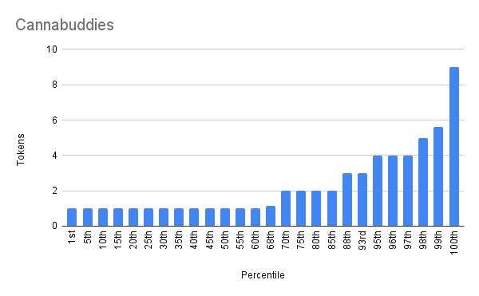

# Cannabuddies

- Etherscan link: <https://etherscan.io/token/0xc44f81fc457d07a0e9c2c7d5a8f890c746901907#balances>

## Distribution

## cannabuddies - Percentile Ranges

| percentile | rank | totalHolders | requiredAmount |
| --- | --- | --- | --- |
| 1% | 3 | 238 | 6 |
| 2% | 5 | 238 | 5 |
| 3% | 8 | 238 | 4 |
| 4% | 10 | 238 | 4 |
| 5% | 12 | 238 | 4 |
| 6% | 15 | 238 | 4 |
| 7% | 17 | 238 | 3 |
| 8% | 20 | 238 | 3 |
| 9% | 22 | 238 | 3 |
| 10% | 24 | 238 | 3 |
| 11% | 27 | 238 | 3 |
| 12% | 29 | 238 | 3 |
| 13% | 31 | 238 | 3 |
| 14% | 34 | 238 | 2 |
| 15% | 36 | 238 | 2 |
| 16% | 39 | 238 | 2 |
| 17% | 41 | 238 | 2 |
| 18% | 43 | 238 | 2 |
| 19% | 46 | 238 | 2 |
| 20% | 48 | 238 | 2 |
| 21% | 50 | 238 | 2 |
| 22% | 53 | 238 | 2 |
| 23% | 55 | 238 | 2 |
| 24% | 58 | 238 | 2 |
| 25% | 60 | 238 | 2 |
| 26% | 62 | 238 | 2 |
| 27% | 65 | 238 | 2 |
| 28% | 67 | 238 | 2 |
| 29% | 70 | 238 | 2 |
| 30% | 72 | 238 | 2 |
| 31% | 74 | 238 | 2 |
| 32% | 77 | 238 | 1 |
| 33% | 79 | 238 | 1 |
| 34% | 81 | 238 | 1 |
| 35% | 84 | 238 | 1 |
| 36% | 86 | 238 | 1 |
| 37% | 89 | 238 | 1 |
| 38% | 91 | 238 | 1 |
| 39% | 93 | 238 | 1 |
| 40% | 96 | 238 | 1 |
| 41% | 98 | 238 | 1 |
| 42% | 100 | 238 | 1 |
| 43% | 103 | 238 | 1 |
| 44% | 105 | 238 | 1 |
| 45% | 108 | 238 | 1 |
| 46% | 110 | 238 | 1 |
| 47% | 112 | 238 | 1 |
| 48% | 115 | 238 | 1 |
| 49% | 117 | 238 | 1 |
| 50% | 120 | 238 | 1 |
| 51% | 122 | 238 | 1 |
| 52% | 124 | 238 | 1 |
| 53% | 127 | 238 | 1 |
| 54% | 129 | 238 | 1 |
| 55% | 131 | 238 | 1 |
| 56% | 134 | 238 | 1 |
| 57% | 136 | 238 | 1 |
| 58% | 139 | 238 | 1 |
| 59% | 141 | 238 | 1 |
| 60% | 143 | 238 | 1 |
| 61% | 146 | 238 | 1 |
| 62% | 148 | 238 | 1 |
| 63% | 150 | 238 | 1 |
| 64% | 153 | 238 | 1 |
| 65% | 155 | 238 | 1 |
| 66% | 158 | 238 | 1 |
| 67% | 160 | 238 | 1 |
| 68% | 162 | 238 | 1 |
| 69% | 165 | 238 | 1 |
| 70% | 167 | 238 | 1 |
| 71% | 169 | 238 | 1 |
| 72% | 172 | 238 | 1 |
| 73% | 174 | 238 | 1 |
| 74% | 177 | 238 | 1 |
| 75% | 179 | 238 | 1 |
| 76% | 181 | 238 | 1 |
| 77% | 184 | 238 | 1 |
| 78% | 186 | 238 | 1 |
| 79% | 189 | 238 | 1 |
| 80% | 191 | 238 | 1 |
| 81% | 193 | 238 | 1 |
| 82% | 196 | 238 | 1 |
| 83% | 198 | 238 | 1 |
| 84% | 200 | 238 | 1 |
| 85% | 203 | 238 | 1 |
| 86% | 205 | 238 | 1 |
| 87% | 208 | 238 | 1 |
| 88% | 210 | 238 | 1 |
| 89% | 212 | 238 | 1 |
| 90% | 215 | 238 | 1 |
| 91% | 217 | 238 | 1 |
| 92% | 219 | 238 | 1 |
| 93% | 222 | 238 | 1 |
| 94% | 224 | 238 | 1 |
| 95% | 227 | 238 | 1 |
| 96% | 229 | 238 | 1 |
| 97% | 231 | 238 | 1 |
| 98% | 234 | 238 | 1 |
| 99% | 236 | 238 | 1 |