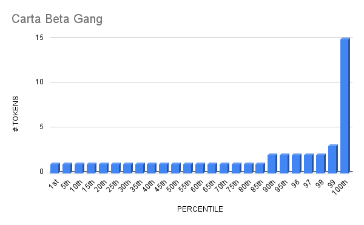

# Carta - Beta Gang

- Etherscan link: <https://etherscan.io/token/0x3e89278355bea30efb73e82fb21d00d6e0ec68fb>

## Distirbution

## Percentiles

| | Points | Min | Max | # In Percentile |
|--|--------|-----|-----|----------|
|88th | 1 | 1 | 1 | 139
|99th | 2 | 2 | 3 | 17
|100th| 3 | 4 | 15 | 1

## carta-beta-gang - Percentile Ranges

| percentile | rank | totalHolders | requiredAmount |
| --- | --- | --- | --- |
| 1% | 2 | 157 | 3 |
| 2% | 4 | 157 | 2 |
| 3% | 5 | 157 | 2 |
| 4% | 7 | 157 | 2 |
| 5% | 8 | 157 | 2 |
| 6% | 10 | 157 | 2 |
| 7% | 11 | 157 | 2 |
| 8% | 13 | 157 | 2 |
| 9% | 15 | 157 | 2 |
| 10% | 16 | 157 | 2 |
| 11% | 18 | 157 | 2 |
| 12% | 19 | 157 | 1 |
| 13% | 21 | 157 | 1 |
| 14% | 22 | 157 | 1 |
| 15% | 24 | 157 | 1 |
| 16% | 26 | 157 | 1 |
| 17% | 27 | 157 | 1 |
| 18% | 29 | 157 | 1 |
| 19% | 30 | 157 | 1 |
| 20% | 32 | 157 | 1 |
| 21% | 33 | 157 | 1 |
| 22% | 35 | 157 | 1 |
| 23% | 37 | 157 | 1 |
| 24% | 38 | 157 | 1 |
| 25% | 40 | 157 | 1 |
| 26% | 41 | 157 | 1 |
| 27% | 43 | 157 | 1 |
| 28% | 44 | 157 | 1 |
| 29% | 46 | 157 | 1 |
| 30% | 48 | 157 | 1 |
| 31% | 49 | 157 | 1 |
| 32% | 51 | 157 | 1 |
| 33% | 52 | 157 | 1 |
| 34% | 54 | 157 | 1 |
| 35% | 55 | 157 | 1 |
| 36% | 57 | 157 | 1 |
| 37% | 59 | 157 | 1 |
| 38% | 60 | 157 | 1 |
| 39% | 62 | 157 | 1 |
| 40% | 63 | 157 | 1 |
| 41% | 65 | 157 | 1 |
| 42% | 66 | 157 | 1 |
| 43% | 68 | 157 | 1 |
| 44% | 70 | 157 | 1 |
| 45% | 71 | 157 | 1 |
| 46% | 73 | 157 | 1 |
| 47% | 74 | 157 | 1 |
| 48% | 76 | 157 | 1 |
| 49% | 77 | 157 | 1 |
| 50% | 79 | 157 | 1 |
| 51% | 81 | 157 | 1 |
| 52% | 82 | 157 | 1 |
| 53% | 84 | 157 | 1 |
| 54% | 85 | 157 | 1 |
| 55% | 87 | 157 | 1 |
| 56% | 88 | 157 | 1 |
| 57% | 90 | 157 | 1 |
| 58% | 92 | 157 | 1 |
| 59% | 93 | 157 | 1 |
| 60% | 95 | 157 | 1 |
| 61% | 96 | 157 | 1 |
| 62% | 98 | 157 | 1 |
| 63% | 99 | 157 | 1 |
| 64% | 101 | 157 | 1 |
| 65% | 103 | 157 | 1 |
| 66% | 104 | 157 | 1 |
| 67% | 106 | 157 | 1 |
| 68% | 107 | 157 | 1 |
| 69% | 109 | 157 | 1 |
| 70% | 110 | 157 | 1 |
| 71% | 112 | 157 | 1 |
| 72% | 114 | 157 | 1 |
| 73% | 115 | 157 | 1 |
| 74% | 117 | 157 | 1 |
| 75% | 118 | 157 | 1 |
| 76% | 120 | 157 | 1 |
| 77% | 121 | 157 | 1 |
| 78% | 123 | 157 | 1 |
| 79% | 125 | 157 | 1 |
| 80% | 126 | 157 | 1 |
| 81% | 128 | 157 | 1 |
| 82% | 129 | 157 | 1 |
| 83% | 131 | 157 | 1 |
| 84% | 132 | 157 | 1 |
| 85% | 134 | 157 | 1 |
| 86% | 136 | 157 | 1 |
| 87% | 137 | 157 | 1 |
| 88% | 139 | 157 | 1 |
| 89% | 140 | 157 | 1 |
| 90% | 142 | 157 | 1 |
| 91% | 143 | 157 | 1 |
| 92% | 145 | 157 | 1 |
| 93% | 147 | 157 | 1 |
| 94% | 148 | 157 | 1 |
| 95% | 150 | 157 | 1 |
| 96% | 151 | 157 | 1 |
| 97% | 153 | 157 | 1 |
| 98% | 154 | 157 | 1 |
| 99% | 156 | 157 | 1 |