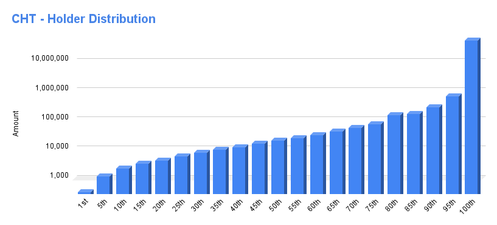

# Chronic Token (CHT)

- Etherscan link: https://etherscan.io/token/0x19fab8f7dffff38268644eaebd3d538f68036000

## Distribution 

## Percentiles 
| | Points | Min | Max | # In Percentile |
|--|--------|-----|-----|----------|
|14th| 0 | 0 | 2,949.06 | 176
|60th| 1 | 2,949.07 | 29,907.26 | 577
|83rd| 2 | 29,907.27 | 126,425.37 | 288
|95th| 3 | 126,425.38 | 631,620.69 |151
|100th| 4 | 631,620.7 | 52,230,931.14 |63

## chronic-token - Percentile Ranges

| percentile | rank | totalHolders | requiredAmount |
| --- | --- | --- | --- |
| 1% | 13 | 1255 | 4370768.47 |
| 2% | 26 | 1255 | 1517840.48 |
| 3% | 38 | 1255 | 1016322.14 |
| 4% | 51 | 1255 | 713146.31 |
| 5% | 63 | 1255 | 636041.19 |
| 6% | 76 | 1255 | 518702.55 |
| 7% | 88 | 1255 | 449975.84 |
| 8% | 101 | 1255 | 366083.13 |
| 9% | 113 | 1255 | 318842.91 |
| 10% | 126 | 1255 | 274079.26 |
| 11% | 139 | 1255 | 248658.07 |
| 12% | 151 | 1255 | 217797.58 |
| 13% | 164 | 1255 | 199438.19 |
| 14% | 176 | 1255 | 178779.87 |
| 15% | 189 | 1255 | 161391.1 |
| 16% | 201 | 1255 | 146172.26 |
| 17% | 214 | 1255 | 127328.33 |
| 18% | 226 | 1255 | 116485.64 |
| 19% | 239 | 1255 | 107540.84 |
| 20% | 252 | 1255 | 100490.93 |
| 21% | 264 | 1255 | 94542.69 |
| 22% | 277 | 1255 | 87799.99 |
| 23% | 289 | 1255 | 81552.71 |
| 24% | 302 | 1255 | 76022.94 |
| 25% | 314 | 1255 | 72574.45 |
| 26% | 327 | 1255 | 69927.4 |
| 27% | 339 | 1255 | 65431.97 |
| 28% | 352 | 1255 | 60415.76 |
| 29% | 364 | 1255 | 57755.34 |
| 30% | 377 | 1255 | 54063.3 |
| 31% | 390 | 1255 | 51292.56 |
| 32% | 402 | 1255 | 49899.62 |
| 33% | 415 | 1255 | 47339.21 |
| 34% | 427 | 1255 | 44006.73 |
| 35% | 440 | 1255 | 40838.89 |
| 36% | 452 | 1255 | 38804.49 |
| 37% | 465 | 1255 | 36062.9 |
| 38% | 477 | 1255 | 33312.29 |
| 39% | 490 | 1255 | 31687.94 |
| 40% | 503 | 1255 | 29907.26 |
| 41% | 515 | 1255 | 29110.7 |
| 42% | 528 | 1255 | 27793.99 |
| 43% | 540 | 1255 | 26230.84 |
| 44% | 553 | 1255 | 25233.44 |
| 45% | 565 | 1255 | 24012.88 |
| 46% | 578 | 1255 | 22934.65 |
| 47% | 590 | 1255 | 21385.84 |
| 48% | 603 | 1255 | 20441.35 |
| 49% | 615 | 1255 | 19992.68 |
| 50% | 628 | 1255 | 19366.26 |
| 51% | 641 | 1255 | 18679.08 |
| 52% | 653 | 1255 | 17620.58 |
| 53% | 666 | 1255 | 16345.58 |
| 54% | 678 | 1255 | 15702.02 |
| 55% | 691 | 1255 | 15027.64 |
| 56% | 703 | 1255 | 14329.9 |
| 57% | 716 | 1255 | 13549.6 |
| 58% | 728 | 1255 | 13145.46 |
| 59% | 741 | 1255 | 12706.67 |
| 60% | 754 | 1255 | 11755.41 |
| 61% | 766 | 1255 | 11181.92 |
| 62% | 779 | 1255 | 10799.43 |
| 63% | 791 | 1255 | 10242.64 |
| 64% | 804 | 1255 | 9981.17 |
| 65% | 816 | 1255 | 9687.8 |
| 66% | 829 | 1255 | 9082.66 |
| 67% | 841 | 1255 | 8576.3 |
| 68% | 854 | 1255 | 8137.65 |
| 69% | 866 | 1255 | 7815.41 |
| 70% | 879 | 1255 | 7525.11 |
| 71% | 892 | 1255 | 7004.56 |
| 72% | 904 | 1255 | 6561.11 |
| 73% | 917 | 1255 | 6250.05 |
| 74% | 929 | 1255 | 5985.16 |
| 75% | 942 | 1255 | 5488.03 |
| 76% | 954 | 1255 | 5209.39 |
| 77% | 967 | 1255 | 5000 |
| 78% | 979 | 1255 | 4665.07 |
| 79% | 992 | 1255 | 4360.69 |
| 80% | 1005 | 1255 | 4032.63 |
| 81% | 1017 | 1255 | 3920.2 |
| 82% | 1030 | 1255 | 3646.1 |
| 83% | 1042 | 1255 | 3555.24 |
| 84% | 1055 | 1255 | 3297.82 |
| 85% | 1067 | 1255 | 3135.69 |
| 86% | 1080 | 1255 | 2938.28 |
| 87% | 1092 | 1255 | 2828.87 |
| 88% | 1105 | 1255 | 2545.66 |
| 89% | 1117 | 1255 | 2425 |
| 90% | 1130 | 1255 | 2136.59 |
| 91% | 1143 | 1255 | 2012.2 |
| 92% | 1155 | 1255 | 1907.33 |
| 93% | 1168 | 1255 | 1717.34 |
| 94% | 1180 | 1255 | 1451.21 |
| 95% | 1193 | 1255 | 1121.04 |
| 96% | 1205 | 1255 | 993.84 |
| 97% | 1218 | 1255 | 864.36 |
| 98% | 1230 | 1255 | 577.98 |
| 99% | 1243 | 1255 | 341 |