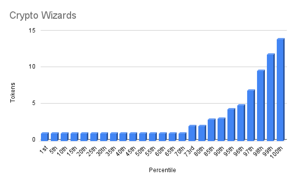

# Phil Siegel - Cryptowizards

- Etherscan link: https://etherscan.io/token/0xc36cc0abd32ffa79798d420ce425f1035a5a243d

## Distribution 

## Percentiles 
| | Points | Min | Max | # In Percentile |
|--|--------|-----|-----|----------|
|70th | 1 | 1 | 1 | 39
|95th | 2 | 2 | 4 | 14
|100th| 3 | 5 | 14 | 2