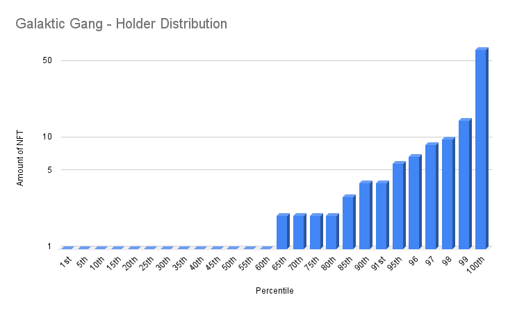

# Galacktic Gang

- Etherscan Link: https://etherscan.io/token/0xF4cd7e65348DEB24e30dedEE639C4936Ae38B763

## Distribution 

## Percentiles 
| | Points | Min | Max | # In Percentile |
|--|--------|-----|-----|----------|
|63rd | 1 | 1 | 1  | 1,620
|95th | 2 | 2 | 4  | 728
|100th| 3 | 5 | 66 | 220
## galacktic-gang - Percentile Ranges

| percentile | rank | totalHolders | requiredAmount |
| --- | --- | --- | --- |
| 1% | 26 | 2568 | 15 |
| 2% | 52 | 2568 | 10 |
| 3% | 78 | 2568 | 9 |
| 4% | 103 | 2568 | 7 |
| 5% | 129 | 2568 | 6 |
| 6% | 155 | 2568 | 5 |
| 7% | 180 | 2568 | 5 |
| 8% | 206 | 2568 | 5 |
| 9% | 232 | 2568 | 4 |
| 10% | 257 | 2568 | 4 |
| 11% | 283 | 2568 | 4 |
| 12% | 309 | 2568 | 3 |
| 13% | 334 | 2568 | 3 |
| 14% | 360 | 2568 | 3 |
| 15% | 386 | 2568 | 3 |
| 16% | 411 | 2568 | 3 |
| 17% | 437 | 2568 | 3 |
| 18% | 463 | 2568 | 3 |
| 19% | 488 | 2568 | 3 |
| 20% | 514 | 2568 | 2 |
| 21% | 540 | 2568 | 2 |
| 22% | 565 | 2568 | 2 |
| 23% | 591 | 2568 | 2 |
| 24% | 617 | 2568 | 2 |
| 25% | 643 | 2568 | 2 |
| 26% | 668 | 2568 | 2 |
| 27% | 694 | 2568 | 2 |
| 28% | 720 | 2568 | 2 |
| 29% | 745 | 2568 | 2 |
| 30% | 771 | 2568 | 2 |
| 31% | 797 | 2568 | 2 |
| 32% | 822 | 2568 | 2 |
| 33% | 848 | 2568 | 2 |
| 34% | 874 | 2568 | 2 |
| 35% | 899 | 2568 | 2 |
| 36% | 925 | 2568 | 2 |
| 37% | 951 | 2568 | 1 |
| 38% | 976 | 2568 | 1 |
| 39% | 1002 | 2568 | 1 |
| 40% | 1028 | 2568 | 1 |
| 41% | 1053 | 2568 | 1 |
| 42% | 1079 | 2568 | 1 |
| 43% | 1105 | 2568 | 1 |
| 44% | 1130 | 2568 | 1 |
| 45% | 1156 | 2568 | 1 |
| 46% | 1182 | 2568 | 1 |
| 47% | 1207 | 2568 | 1 |
| 48% | 1233 | 2568 | 1 |
| 49% | 1259 | 2568 | 1 |
| 50% | 1285 | 2568 | 1 |
| 51% | 1310 | 2568 | 1 |
| 52% | 1336 | 2568 | 1 |
| 53% | 1362 | 2568 | 1 |
| 54% | 1387 | 2568 | 1 |
| 55% | 1413 | 2568 | 1 |
| 56% | 1439 | 2568 | 1 |
| 57% | 1464 | 2568 | 1 |
| 58% | 1490 | 2568 | 1 |
| 59% | 1516 | 2568 | 1 |
| 60% | 1541 | 2568 | 1 |
| 61% | 1567 | 2568 | 1 |
| 62% | 1593 | 2568 | 1 |
| 63% | 1618 | 2568 | 1 |
| 64% | 1644 | 2568 | 1 |
| 65% | 1670 | 2568 | 1 |
| 66% | 1695 | 2568 | 1 |
| 67% | 1721 | 2568 | 1 |
| 68% | 1747 | 2568 | 1 |
| 69% | 1772 | 2568 | 1 |
| 70% | 1798 | 2568 | 1 |
| 71% | 1824 | 2568 | 1 |
| 72% | 1849 | 2568 | 1 |
| 73% | 1875 | 2568 | 1 |
| 74% | 1901 | 2568 | 1 |
| 75% | 1927 | 2568 | 1 |
| 76% | 1952 | 2568 | 1 |
| 77% | 1978 | 2568 | 1 |
| 78% | 2004 | 2568 | 1 |
| 79% | 2029 | 2568 | 1 |
| 80% | 2055 | 2568 | 1 |
| 81% | 2081 | 2568 | 1 |
| 82% | 2106 | 2568 | 1 |
| 83% | 2132 | 2568 | 1 |
| 84% | 2158 | 2568 | 1 |
| 85% | 2183 | 2568 | 1 |
| 86% | 2209 | 2568 | 1 |
| 87% | 2235 | 2568 | 1 |
| 88% | 2260 | 2568 | 1 |
| 89% | 2286 | 2568 | 1 |
| 90% | 2312 | 2568 | 1 |
| 91% | 2337 | 2568 | 1 |
| 92% | 2363 | 2568 | 1 |
| 93% | 2389 | 2568 | 1 |
| 94% | 2414 | 2568 | 1 |
| 95% | 2440 | 2568 | 1 |
| 96% | 2466 | 2568 | 1 |
| 97% | 2491 | 2568 | 1 |
| 98% | 2517 | 2568 | 1 |
| 99% | 2543 | 2568 | 1 |