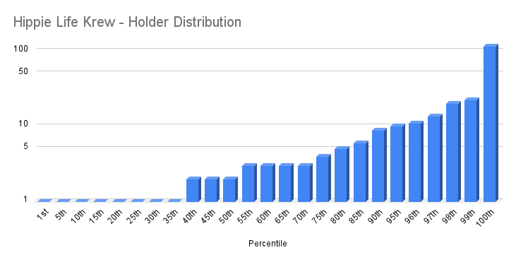

# Hippie Life Krew

- Etherscan link: https://etherscan.io/token/0x524c08be48e0b414c452da3d142c075444a2bd9e 

## Distribution 

## Percentiles
| | Points | Min | Max | # In Percentile |
|--|--------|-----|-----|----------|
|37th | 1 | 1 | 1  |128
|99th | 2 | 2 | 22  |210
|100th| 3 | 23 | 116| 4
## hippie-life-krew - Percentile Ranges

| percentile | rank | totalHolders | requiredAmount |
| --- | --- | --- | --- |
| 1% | 4 | 342 | 24 |
| 2% | 7 | 342 | 20 |
| 3% | 11 | 342 | 14 |
| 4% | 14 | 342 | 11 |
| 5% | 18 | 342 | 10 |
| 6% | 21 | 342 | 10 |
| 7% | 24 | 342 | 10 |
| 8% | 28 | 342 | 10 |
| 9% | 31 | 342 | 10 |
| 10% | 35 | 342 | 9 |
| 11% | 38 | 342 | 7 |
| 12% | 42 | 342 | 6 |
| 13% | 45 | 342 | 6 |
| 14% | 48 | 342 | 6 |
| 15% | 52 | 342 | 6 |
| 16% | 55 | 342 | 6 |
| 17% | 59 | 342 | 5 |
| 18% | 62 | 342 | 5 |
| 19% | 65 | 342 | 5 |
| 20% | 69 | 342 | 5 |
| 21% | 72 | 342 | 5 |
| 22% | 76 | 342 | 5 |
| 23% | 79 | 342 | 4 |
| 24% | 83 | 342 | 4 |
| 25% | 86 | 342 | 4 |
| 26% | 89 | 342 | 4 |
| 27% | 93 | 342 | 4 |
| 28% | 96 | 342 | 4 |
| 29% | 100 | 342 | 4 |
| 30% | 103 | 342 | 3 |
| 31% | 107 | 342 | 3 |
| 32% | 110 | 342 | 3 |
| 33% | 113 | 342 | 3 |
| 34% | 117 | 342 | 3 |
| 35% | 120 | 342 | 3 |
| 36% | 124 | 342 | 3 |
| 37% | 127 | 342 | 3 |
| 38% | 130 | 342 | 3 |
| 39% | 134 | 342 | 3 |
| 40% | 137 | 342 | 3 |
| 41% | 141 | 342 | 3 |
| 42% | 144 | 342 | 3 |
| 43% | 148 | 342 | 3 |
| 44% | 151 | 342 | 3 |
| 45% | 154 | 342 | 3 |
| 46% | 158 | 342 | 3 |
| 47% | 161 | 342 | 3 |
| 48% | 165 | 342 | 3 |
| 49% | 168 | 342 | 3 |
| 50% | 172 | 342 | 2 |
| 51% | 175 | 342 | 2 |
| 52% | 178 | 342 | 2 |
| 53% | 182 | 342 | 2 |
| 54% | 185 | 342 | 2 |
| 55% | 189 | 342 | 2 |
| 56% | 192 | 342 | 2 |
| 57% | 195 | 342 | 2 |
| 58% | 199 | 342 | 2 |
| 59% | 202 | 342 | 2 |
| 60% | 206 | 342 | 2 |
| 61% | 209 | 342 | 2 |
| 62% | 213 | 342 | 2 |
| 63% | 216 | 342 | 1 |
| 64% | 219 | 342 | 1 |
| 65% | 223 | 342 | 1 |
| 66% | 226 | 342 | 1 |
| 67% | 230 | 342 | 1 |
| 68% | 233 | 342 | 1 |
| 69% | 236 | 342 | 1 |
| 70% | 240 | 342 | 1 |
| 71% | 243 | 342 | 1 |
| 72% | 247 | 342 | 1 |
| 73% | 250 | 342 | 1 |
| 74% | 254 | 342 | 1 |
| 75% | 257 | 342 | 1 |
| 76% | 260 | 342 | 1 |
| 77% | 264 | 342 | 1 |
| 78% | 267 | 342 | 1 |
| 79% | 271 | 342 | 1 |
| 80% | 274 | 342 | 1 |
| 81% | 278 | 342 | 1 |
| 82% | 281 | 342 | 1 |
| 83% | 284 | 342 | 1 |
| 84% | 288 | 342 | 1 |
| 85% | 291 | 342 | 1 |
| 86% | 295 | 342 | 1 |
| 87% | 298 | 342 | 1 |
| 88% | 301 | 342 | 1 |
| 89% | 305 | 342 | 1 |
| 90% | 308 | 342 | 1 |
| 91% | 312 | 342 | 1 |
| 92% | 315 | 342 | 1 |
| 93% | 319 | 342 | 1 |
| 94% | 322 | 342 | 1 |
| 95% | 325 | 342 | 1 |
| 96% | 329 | 342 | 1 |
| 97% | 332 | 342 | 1 |
| 98% | 336 | 342 | 1 |
| 99% | 339 | 342 | 1 |