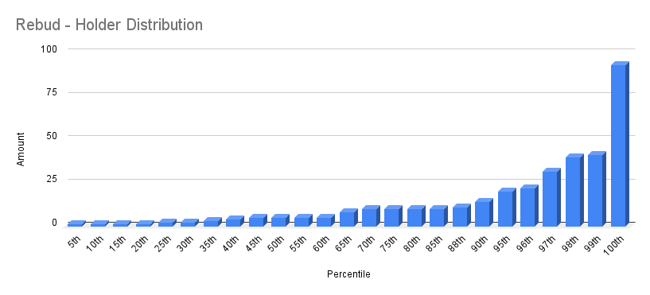

# Rebud 
- Etherscan link: https://etherscan.io/token/0xf850aa77f3eb0c0fffa1ffd7548829967fa1897a

## Distribution 

## Percentiles

| | Points | Min | Max | # In Percentile |
|--|--------|-----|-----|----------|
| 1st-87th   | 1  | 1  | 10 | 513 |
| 88th-90th  | 2  | 11 | 14 | 66 |
| 79th-100th | 3  | 15 | 93 | 6 | 
## rebud - Percentile Ranges

| percentile | rank | totalHolders | requiredAmount |
| --- | --- | --- | --- |
| 1% | 6 | 585 | 47 |
| 2% | 12 | 585 | 40 |
| 3% | 18 | 585 | 33 |
| 4% | 24 | 585 | 22 |
| 5% | 30 | 585 | 20 |
| 6% | 36 | 585 | 20 |
| 7% | 41 | 585 | 20 |
| 8% | 47 | 585 | 17 |
| 9% | 53 | 585 | 15 |
| 10% | 59 | 585 | 14 |
| 11% | 65 | 585 | 12 |
| 12% | 71 | 585 | 11 |
| 13% | 77 | 585 | 10 |
| 14% | 82 | 585 | 10 |
| 15% | 88 | 585 | 10 |
| 16% | 94 | 585 | 10 |
| 17% | 100 | 585 | 10 |
| 18% | 106 | 585 | 10 |
| 19% | 112 | 585 | 10 |
| 20% | 118 | 585 | 10 |
| 21% | 123 | 585 | 10 |
| 22% | 129 | 585 | 10 |
| 23% | 135 | 585 | 10 |
| 24% | 141 | 585 | 10 |
| 25% | 147 | 585 | 10 |
| 26% | 153 | 585 | 10 |
| 27% | 158 | 585 | 10 |
| 28% | 164 | 585 | 10 |
| 29% | 170 | 585 | 10 |
| 30% | 176 | 585 | 10 |
| 31% | 182 | 585 | 10 |
| 32% | 188 | 585 | 9 |
| 33% | 194 | 585 | 8 |
| 34% | 199 | 585 | 8 |
| 35% | 205 | 585 | 8 |
| 36% | 211 | 585 | 8 |
| 37% | 217 | 585 | 7 |
| 38% | 223 | 585 | 6 |
| 39% | 229 | 585 | 6 |
| 40% | 235 | 585 | 5 |
| 41% | 240 | 585 | 5 |
| 42% | 246 | 585 | 5 |
| 43% | 252 | 585 | 5 |
| 44% | 258 | 585 | 5 |
| 45% | 264 | 585 | 5 |
| 46% | 270 | 585 | 5 |
| 47% | 275 | 585 | 5 |
| 48% | 281 | 585 | 5 |
| 49% | 287 | 585 | 5 |
| 50% | 293 | 585 | 5 |
| 51% | 299 | 585 | 5 |
| 52% | 305 | 585 | 5 |
| 53% | 311 | 585 | 5 |
| 54% | 316 | 585 | 5 |
| 55% | 322 | 585 | 5 |
| 56% | 328 | 585 | 5 |
| 57% | 334 | 585 | 5 |
| 58% | 340 | 585 | 4 |
| 59% | 346 | 585 | 4 |
| 60% | 352 | 585 | 4 |
| 61% | 357 | 585 | 4 |
| 62% | 363 | 585 | 4 |
| 63% | 369 | 585 | 4 |
| 64% | 375 | 585 | 3 |
| 65% | 381 | 585 | 3 |
| 66% | 387 | 585 | 2 |
| 67% | 392 | 585 | 2 |
| 68% | 398 | 585 | 2 |
| 69% | 404 | 585 | 2 |
| 70% | 410 | 585 | 2 |
| 71% | 416 | 585 | 2 |
| 72% | 422 | 585 | 2 |
| 73% | 428 | 585 | 2 |
| 74% | 433 | 585 | 2 |
| 75% | 439 | 585 | 2 |
| 76% | 445 | 585 | 1 |
| 77% | 451 | 585 | 1 |
| 78% | 457 | 585 | 1 |
| 79% | 463 | 585 | 1 |
| 80% | 469 | 585 | 1 |
| 81% | 474 | 585 | 1 |
| 82% | 480 | 585 | 1 |
| 83% | 486 | 585 | 1 |
| 84% | 492 | 585 | 1 |
| 85% | 498 | 585 | 1 |
| 86% | 504 | 585 | 1 |
| 87% | 509 | 585 | 1 |
| 88% | 515 | 585 | 1 |
| 89% | 521 | 585 | 1 |
| 90% | 527 | 585 | 1 |
| 91% | 533 | 585 | 1 |
| 92% | 539 | 585 | 1 |
| 93% | 545 | 585 | 1 |
| 94% | 550 | 585 | 1 |
| 95% | 556 | 585 | 1 |
| 96% | 562 | 585 | 1 |
| 97% | 568 | 585 | 1 |
| 98% | 574 | 585 | 1 |
| 99% | 580 | 585 | 1 |