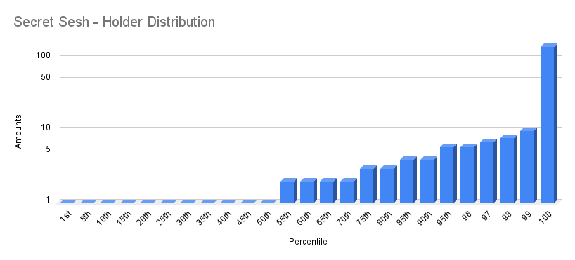

# Secret Sesh 

- Etherscan link: https://etherscan.io/token/0x7c126002d0bc83d8604d9f6ab429c3743f48aca0

## Distribution 

## Percentiles 
| | Points | Min | Max | # In Percentile |
|--|--------|-----|-----|----------|
|| 1 | 1 | 1 | 275|
|| 2 | 2 | 4 | 200|
|| 3 | 5 | 148| 52|
## secret-sesh - Percentile Ranges

| percentile | rank | totalHolders | requiredAmount |
| --- | --- | --- | --- |
| 1% | 6 | 527 | 10 |
| 2% | 11 | 527 | 8 |
| 3% | 16 | 527 | 7 |
| 4% | 22 | 527 | 6 |
| 5% | 27 | 527 | 6 |
| 6% | 32 | 527 | 5 |
| 7% | 37 | 527 | 5 |
| 8% | 43 | 527 | 5 |
| 9% | 48 | 527 | 5 |
| 10% | 53 | 527 | 4 |
| 11% | 58 | 527 | 4 |
| 12% | 64 | 527 | 4 |
| 13% | 69 | 527 | 4 |
| 14% | 74 | 527 | 4 |
| 15% | 80 | 527 | 4 |
| 16% | 85 | 527 | 3 |
| 17% | 90 | 527 | 3 |
| 18% | 95 | 527 | 3 |
| 19% | 101 | 527 | 3 |
| 20% | 106 | 527 | 3 |
| 21% | 111 | 527 | 3 |
| 22% | 116 | 527 | 3 |
| 23% | 122 | 527 | 3 |
| 24% | 127 | 527 | 3 |
| 25% | 132 | 527 | 3 |
| 26% | 138 | 527 | 2 |
| 27% | 143 | 527 | 2 |
| 28% | 148 | 527 | 2 |
| 29% | 153 | 527 | 2 |
| 30% | 159 | 527 | 2 |
| 31% | 164 | 527 | 2 |
| 32% | 169 | 527 | 2 |
| 33% | 174 | 527 | 2 |
| 34% | 180 | 527 | 2 |
| 35% | 185 | 527 | 2 |
| 36% | 190 | 527 | 2 |
| 37% | 195 | 527 | 2 |
| 38% | 201 | 527 | 2 |
| 39% | 206 | 527 | 2 |
| 40% | 211 | 527 | 2 |
| 41% | 217 | 527 | 2 |
| 42% | 222 | 527 | 2 |
| 43% | 227 | 527 | 2 |
| 44% | 232 | 527 | 2 |
| 45% | 238 | 527 | 2 |
| 46% | 243 | 527 | 2 |
| 47% | 248 | 527 | 2 |
| 48% | 253 | 527 | 1 |
| 49% | 259 | 527 | 1 |
| 50% | 264 | 527 | 1 |
| 51% | 269 | 527 | 1 |
| 52% | 275 | 527 | 1 |
| 53% | 280 | 527 | 1 |
| 54% | 285 | 527 | 1 |
| 55% | 290 | 527 | 1 |
| 56% | 296 | 527 | 1 |
| 57% | 301 | 527 | 1 |
| 58% | 306 | 527 | 1 |
| 59% | 311 | 527 | 1 |
| 60% | 317 | 527 | 1 |
| 61% | 322 | 527 | 1 |
| 62% | 327 | 527 | 1 |
| 63% | 333 | 527 | 1 |
| 64% | 338 | 527 | 1 |
| 65% | 343 | 527 | 1 |
| 66% | 348 | 527 | 1 |
| 67% | 354 | 527 | 1 |
| 68% | 359 | 527 | 1 |
| 69% | 364 | 527 | 1 |
| 70% | 369 | 527 | 1 |
| 71% | 375 | 527 | 1 |
| 72% | 380 | 527 | 1 |
| 73% | 385 | 527 | 1 |
| 74% | 390 | 527 | 1 |
| 75% | 396 | 527 | 1 |
| 76% | 401 | 527 | 1 |
| 77% | 406 | 527 | 1 |
| 78% | 412 | 527 | 1 |
| 79% | 417 | 527 | 1 |
| 80% | 422 | 527 | 1 |
| 81% | 427 | 527 | 1 |
| 82% | 433 | 527 | 1 |
| 83% | 438 | 527 | 1 |
| 84% | 443 | 527 | 1 |
| 85% | 448 | 527 | 1 |
| 86% | 454 | 527 | 1 |
| 87% | 459 | 527 | 1 |
| 88% | 464 | 527 | 1 |
| 89% | 470 | 527 | 1 |
| 90% | 475 | 527 | 1 |
| 91% | 480 | 527 | 1 |
| 92% | 485 | 527 | 1 |
| 93% | 491 | 527 | 1 |
| 94% | 496 | 527 | 1 |
| 95% | 501 | 527 | 1 |
| 96% | 506 | 527 | 1 |
| 97% | 512 | 527 | 1 |
| 98% | 517 | 527 | 1 |
| 99% | 522 | 527 | 1 |