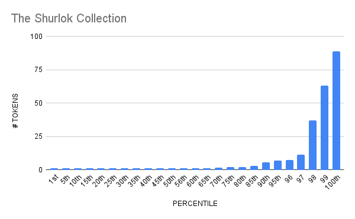

# The Shurlok Holms Collection 

- OpenSea Analytics: https://opensea.io/collection/shurlokholm-collection/analytics

## Distribution 

## Percentiles 

| | Points | Min | Max | # In Percentile |
|--|--------|-----|-----|----------|
|| 1 | 1 | 1 | 23
|| 2 | 2 | 5 | 6
|| 3 | 6 | 89| 4
## shurlok - Percentile Ranges

| percentile | rank | totalHolders | requiredAmount |
| --- | --- | --- | --- |
| 1% | 1 | 33 | 89 |
| 2% | 1 | 33 | 89 |
| 3% | 1 | 33 | 89 |
| 4% | 2 | 33 | 8 |
| 5% | 2 | 33 | 8 |
| 6% | 2 | 33 | 8 |
| 7% | 3 | 33 | 6 |
| 8% | 3 | 33 | 6 |
| 9% | 3 | 33 | 6 |
| 10% | 4 | 33 | 6 |
| 11% | 4 | 33 | 6 |
| 12% | 4 | 33 | 6 |
| 13% | 5 | 33 | 3 |
| 14% | 5 | 33 | 3 |
| 15% | 5 | 33 | 3 |
| 16% | 6 | 33 | 3 |
| 17% | 6 | 33 | 3 |
| 18% | 6 | 33 | 3 |
| 19% | 7 | 33 | 2 |
| 20% | 7 | 33 | 2 |
| 21% | 7 | 33 | 2 |
| 22% | 8 | 33 | 2 |
| 23% | 8 | 33 | 2 |
| 24% | 8 | 33 | 2 |
| 25% | 9 | 33 | 2 |
| 26% | 9 | 33 | 2 |
| 27% | 9 | 33 | 2 |
| 28% | 10 | 33 | 2 |
| 29% | 10 | 33 | 2 |
| 30% | 10 | 33 | 2 |
| 31% | 11 | 33 | 1 |
| 32% | 11 | 33 | 1 |
| 33% | 11 | 33 | 1 |
| 34% | 12 | 33 | 1 |
| 35% | 12 | 33 | 1 |
| 36% | 12 | 33 | 1 |
| 37% | 13 | 33 | 1 |
| 38% | 13 | 33 | 1 |
| 39% | 13 | 33 | 1 |
| 40% | 14 | 33 | 1 |
| 41% | 14 | 33 | 1 |
| 42% | 14 | 33 | 1 |
| 43% | 15 | 33 | 1 |
| 44% | 15 | 33 | 1 |
| 45% | 15 | 33 | 1 |
| 46% | 16 | 33 | 1 |
| 47% | 16 | 33 | 1 |
| 48% | 16 | 33 | 1 |
| 49% | 17 | 33 | 1 |
| 50% | 17 | 33 | 1 |
| 51% | 17 | 33 | 1 |
| 52% | 18 | 33 | 1 |
| 53% | 18 | 33 | 1 |
| 54% | 18 | 33 | 1 |
| 55% | 19 | 33 | 1 |
| 56% | 19 | 33 | 1 |
| 57% | 19 | 33 | 1 |
| 58% | 20 | 33 | 1 |
| 59% | 20 | 33 | 1 |
| 60% | 20 | 33 | 1 |
| 61% | 21 | 33 | 1 |
| 62% | 21 | 33 | 1 |
| 63% | 21 | 33 | 1 |
| 64% | 22 | 33 | 1 |
| 65% | 22 | 33 | 1 |
| 66% | 22 | 33 | 1 |
| 67% | 23 | 33 | 1 |
| 68% | 23 | 33 | 1 |
| 69% | 23 | 33 | 1 |
| 70% | 24 | 33 | 1 |
| 71% | 24 | 33 | 1 |
| 72% | 24 | 33 | 1 |
| 73% | 25 | 33 | 1 |
| 74% | 25 | 33 | 1 |
| 75% | 25 | 33 | 1 |
| 76% | 26 | 33 | 1 |
| 77% | 26 | 33 | 1 |
| 78% | 26 | 33 | 1 |
| 79% | 27 | 33 | 1 |
| 80% | 27 | 33 | 1 |
| 81% | 27 | 33 | 1 |
| 82% | 28 | 33 | 1 |
| 83% | 28 | 33 | 1 |
| 84% | 28 | 33 | 1 |
| 85% | 29 | 33 | 1 |
| 86% | 29 | 33 | 1 |
| 87% | 29 | 33 | 1 |
| 88% | 30 | 33 | 1 |
| 89% | 30 | 33 | 1 |
| 90% | 30 | 33 | 1 |
| 91% | 31 | 33 | 1 |
| 92% | 31 | 33 | 1 |
| 93% | 31 | 33 | 1 |
| 94% | 32 | 33 | 1 |
| 95% | 32 | 33 | 1 |
| 96% | 32 | 33 | 1 |
| 97% | 33 | 33 | 1 |
| 98% | 33 | 33 | 1 |
| 99% | 33 | 33 | 1 |