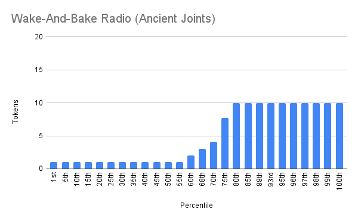

# Wake-And-Bake Radio

- Etherscan link: https://etherscan.io/token/0xe48790b5f261c5ea0f229deeebd886ca6e2e4959#balances

## Distribution 
 

## Percentiles 

| | Points | Min | Max | # In Percentile |
|--|--------|-----|-----|----------|
| 1st-57th   | 1  | 1  | 1 | 88
| 58th-78th  | 2  | 2  | 9 | 33
| 79th-100th | 3  | 10 | 10 | 33 | 
## wake-and-bake - Percentile Ranges

| percentile | rank | totalHolders | requiredAmount |
| --- | --- | --- | --- |
| 1% | 2 | 154 | 10 |
| 2% | 4 | 154 | 10 |
| 3% | 5 | 154 | 10 |
| 4% | 7 | 154 | 10 |
| 5% | 8 | 154 | 10 |
| 6% | 10 | 154 | 10 |
| 7% | 11 | 154 | 10 |
| 8% | 13 | 154 | 10 |
| 9% | 14 | 154 | 10 |
| 10% | 16 | 154 | 10 |
| 11% | 17 | 154 | 10 |
| 12% | 19 | 154 | 10 |
| 13% | 21 | 154 | 10 |
| 14% | 22 | 154 | 10 |
| 15% | 24 | 154 | 10 |
| 16% | 25 | 154 | 10 |
| 17% | 27 | 154 | 10 |
| 18% | 28 | 154 | 10 |
| 19% | 30 | 154 | 10 |
| 20% | 31 | 154 | 10 |
| 21% | 33 | 154 | 10 |
| 22% | 34 | 154 | 9 |
| 23% | 36 | 154 | 9 |
| 24% | 37 | 154 | 9 |
| 25% | 39 | 154 | 8 |
| 26% | 41 | 154 | 7 |
| 27% | 42 | 154 | 5 |
| 28% | 44 | 154 | 5 |
| 29% | 45 | 154 | 5 |
| 30% | 47 | 154 | 4 |
| 31% | 48 | 154 | 4 |
| 32% | 50 | 154 | 3 |
| 33% | 51 | 154 | 3 |
| 34% | 53 | 154 | 3 |
| 35% | 54 | 154 | 3 |
| 36% | 56 | 154 | 3 |
| 37% | 57 | 154 | 3 |
| 38% | 59 | 154 | 2 |
| 39% | 61 | 154 | 2 |
| 40% | 62 | 154 | 2 |
| 41% | 64 | 154 | 2 |
| 42% | 65 | 154 | 2 |
| 43% | 67 | 154 | 1 |
| 44% | 68 | 154 | 1 |
| 45% | 70 | 154 | 1 |
| 46% | 71 | 154 | 1 |
| 47% | 73 | 154 | 1 |
| 48% | 74 | 154 | 1 |
| 49% | 76 | 154 | 1 |
| 50% | 78 | 154 | 1 |
| 51% | 79 | 154 | 1 |
| 52% | 81 | 154 | 1 |
| 53% | 82 | 154 | 1 |
| 54% | 84 | 154 | 1 |
| 55% | 85 | 154 | 1 |
| 56% | 87 | 154 | 1 |
| 57% | 88 | 154 | 1 |
| 58% | 90 | 154 | 1 |
| 59% | 91 | 154 | 1 |
| 60% | 93 | 154 | 1 |
| 61% | 94 | 154 | 1 |
| 62% | 96 | 154 | 1 |
| 63% | 98 | 154 | 1 |
| 64% | 99 | 154 | 1 |
| 65% | 101 | 154 | 1 |
| 66% | 102 | 154 | 1 |
| 67% | 104 | 154 | 1 |
| 68% | 105 | 154 | 1 |
| 69% | 107 | 154 | 1 |
| 70% | 108 | 154 | 1 |
| 71% | 110 | 154 | 1 |
| 72% | 111 | 154 | 1 |
| 73% | 113 | 154 | 1 |
| 74% | 114 | 154 | 1 |
| 75% | 116 | 154 | 1 |
| 76% | 118 | 154 | 1 |
| 77% | 119 | 154 | 1 |
| 78% | 121 | 154 | 1 |
| 79% | 122 | 154 | 1 |
| 80% | 124 | 154 | 1 |
| 81% | 125 | 154 | 1 |
| 82% | 127 | 154 | 1 |
| 83% | 128 | 154 | 1 |
| 84% | 130 | 154 | 1 |
| 85% | 131 | 154 | 1 |
| 86% | 133 | 154 | 1 |
| 87% | 134 | 154 | 1 |
| 88% | 136 | 154 | 1 |
| 89% | 138 | 154 | 1 |
| 90% | 139 | 154 | 1 |
| 91% | 141 | 154 | 1 |
| 92% | 142 | 154 | 1 |
| 93% | 144 | 154 | 1 |
| 94% | 145 | 154 | 1 |
| 95% | 147 | 154 | 1 |
| 96% | 148 | 154 | 1 |
| 97% | 150 | 154 | 1 |
| 98% | 151 | 154 | 1 |
| 99% | 153 | 154 | 1 |