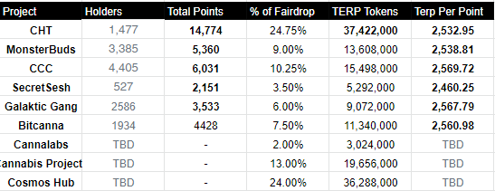

# Points

## Requirements
The goal was to find a solution to normalize a set of variables (project, token balance, wallet address) within datasets that were independent from each other. In order to do so, we can work with the percentile rank system. By plotting where a token holder existed within a percentile range, this was a way to normalize the point distribution between projects.

## Fair Points Distribution
The following chart & its data was used to track how fair point distribution between projects token holders are. 

