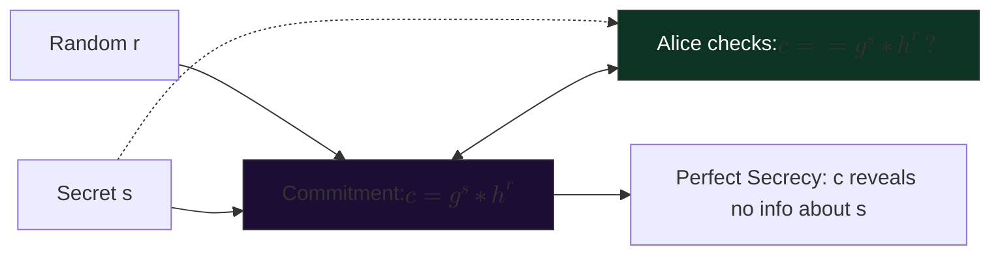

# Cryptography

## Pedersen Commitments (Perfect Secrecy)

```mermaid
graph LR
    A[Secret s] --> B[Commitment: $$c = g^s * h^r$$]
    B <--> C[Alice checks: $$c == g^s * h^r?$$]
    D[Random r] --> B
    B --> E[Perfect Secrecy: c reveals no info about s]
    A -.-> C
    style B fill:#1b0d33,stroke:#333
    style C fill:#0d3323,stroke:#333,color:#fff
```
 